# Complementario 1
 
# INTEGRANTES
* Muñoz Lopez Kelvin Paul
* Pincay Gonzalez Manuel Jarod
* Reyes Carreño Jesús David 
* Yudeh Andres Branly  

# Asignacion
* Muñoz Lopez Kelvin Paul  -- unidades
* Pincay Gonzalez Manuel Jarod -- Mantenimiento
* Reyes Carreño Jesús David -- Usuarios
* Yudeh Cedeño Andres Branly -- Repostaje
# DIAGRAMA ENTIDAD RELACIÓN
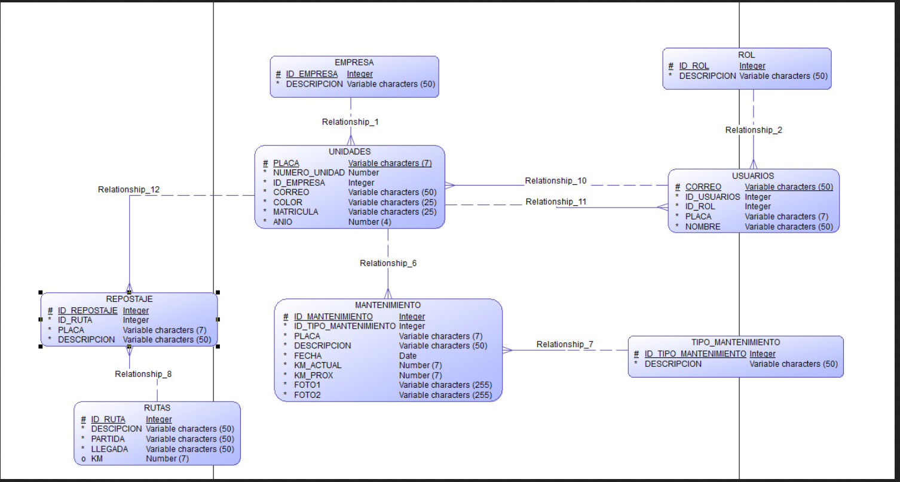

## Base de datos
La base de datos que se va a utilizar para el desarrollo de las practicas y del trabajo complementario es MongoDB 
## Desarrollo de entidades-backend
* Muñoz Lopez Kelvin Paul  -- unidades
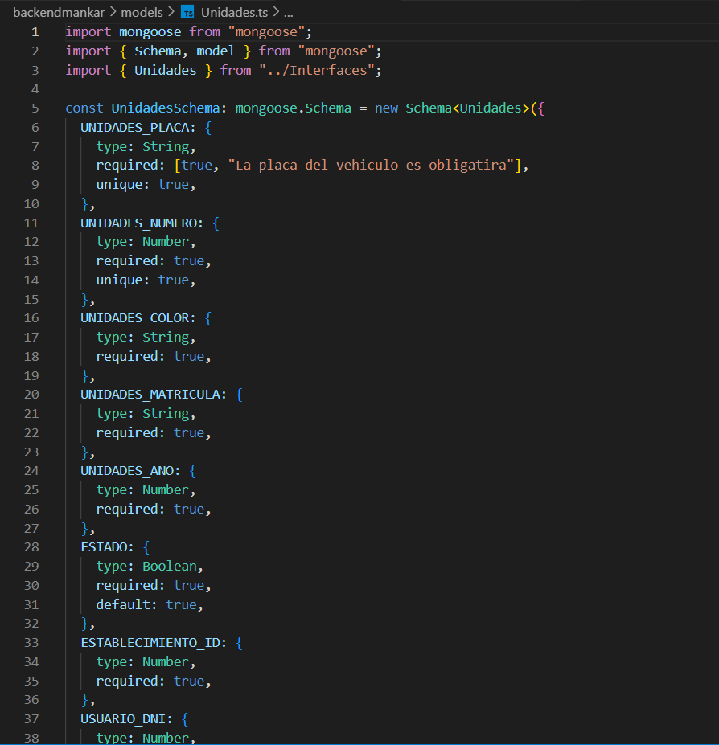
* Pincay Gonzalez Manuel Jarod -- Mantenimiento
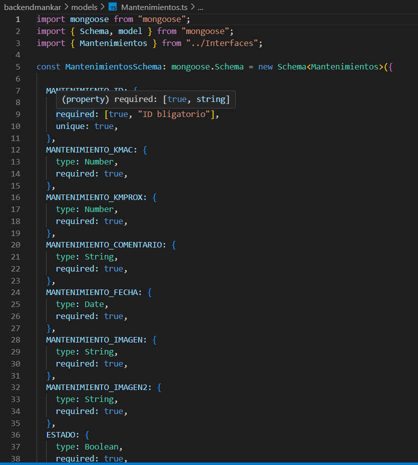
* Reyes Carreño Jesús David -- Usuarios
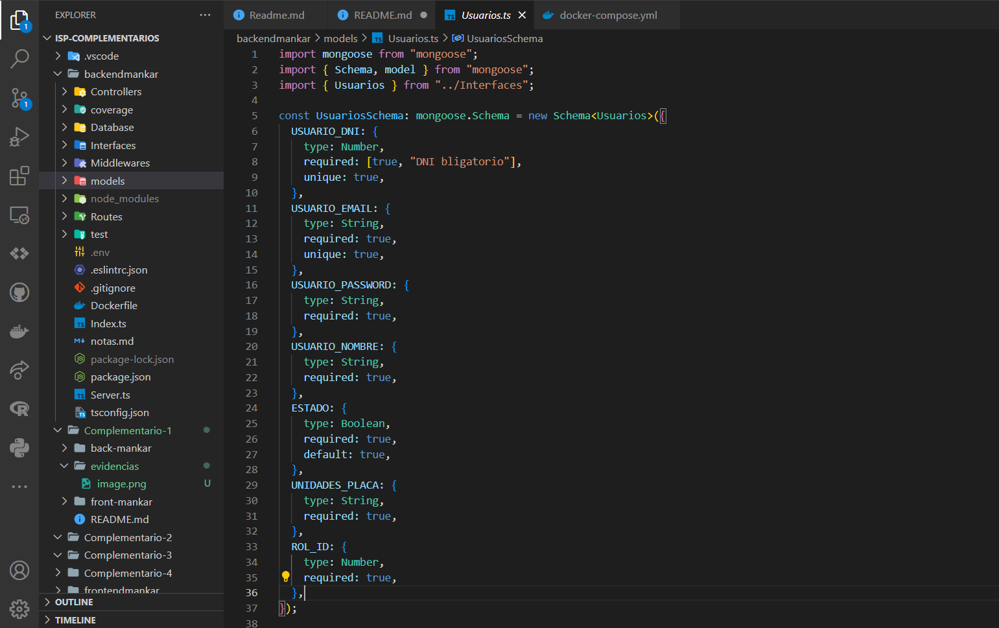
* Yudeh Cedeño Andres Branly -- Repostaje
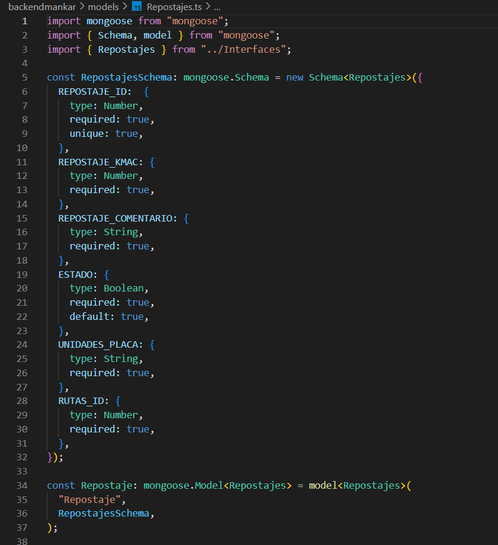

## Despliegue de la aplicacion de las entidades con el frontend
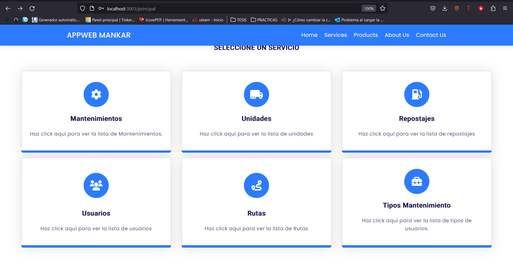
* Muñoz Lopez Kelvin Paul  -- unidades
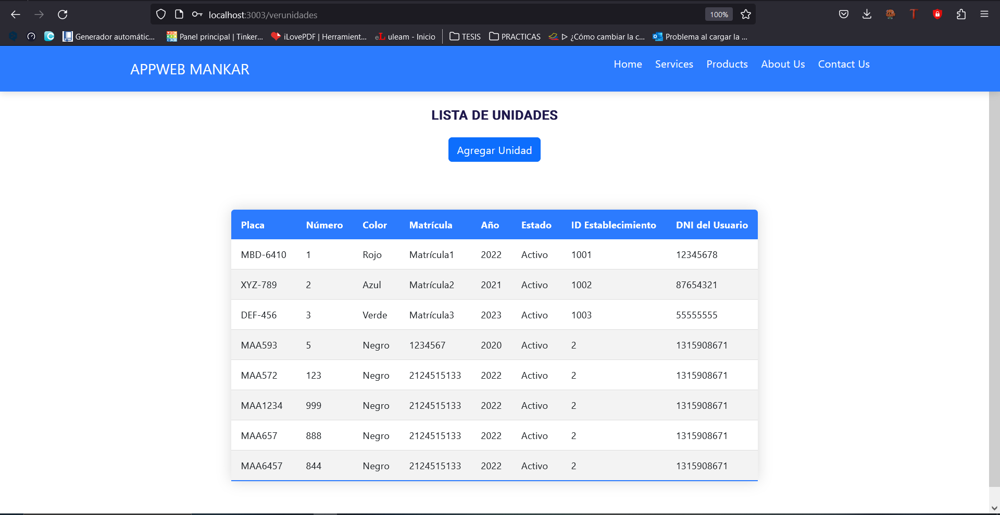
* Pincay Gonzalez Manuel Jarod -- Mantenimiento
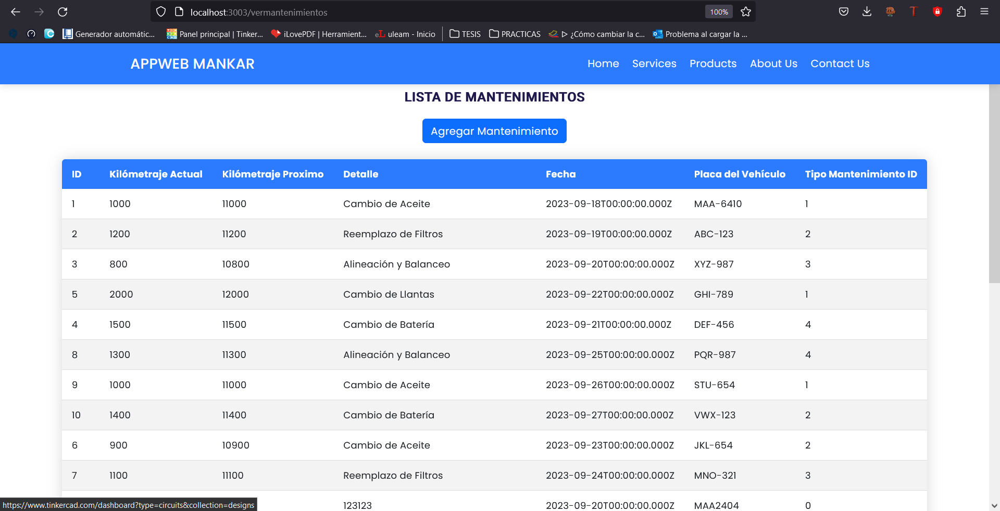
* Reyes Carreño Jesús David -- Usuarios
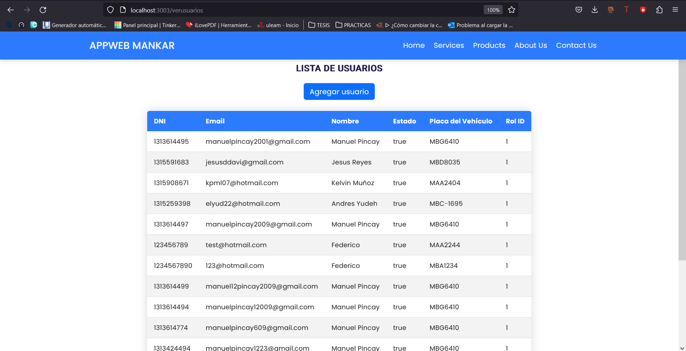
* Yudeh Cedeño Andres Branly -- Repostaje
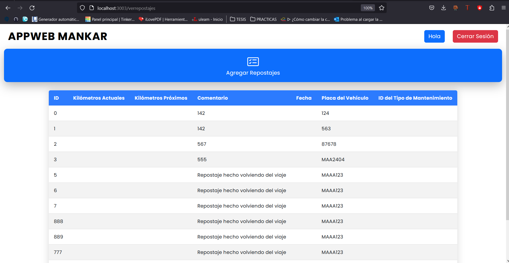

## Desarrollo del archivo docker-compose para el desarrollo de dockerización, se levanta con el comando:
```bash 
docker-compose up  
```
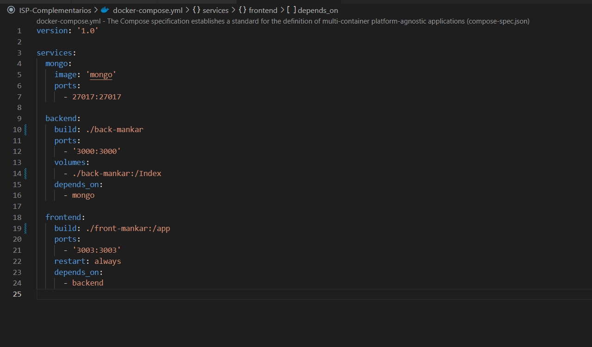

## Comprobación de la creacion de las imagenes docker en docker-Desktop

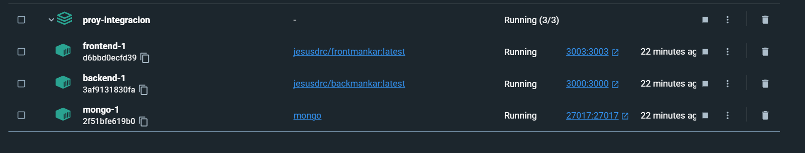

## Comprobación de los servicios de backend y frontend
- Backend
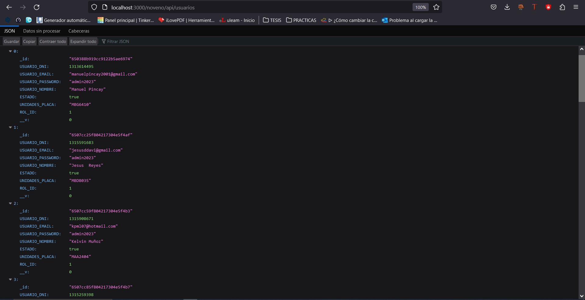
- Frontend
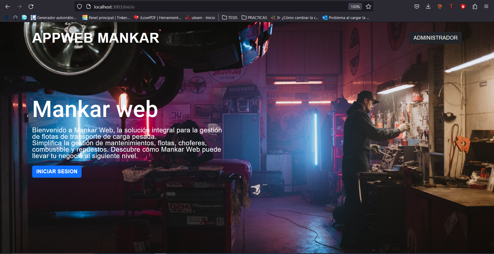