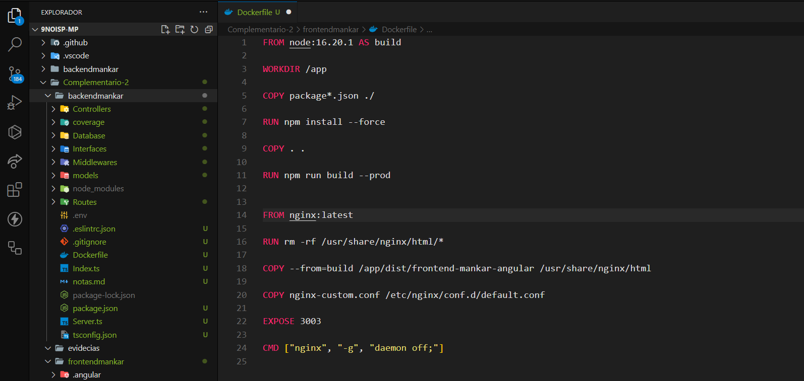
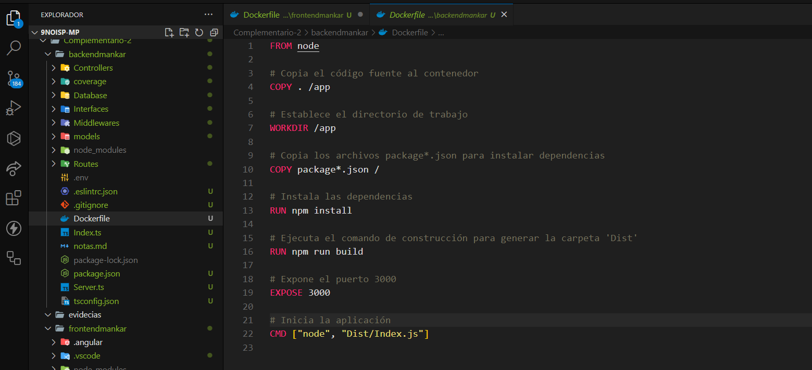
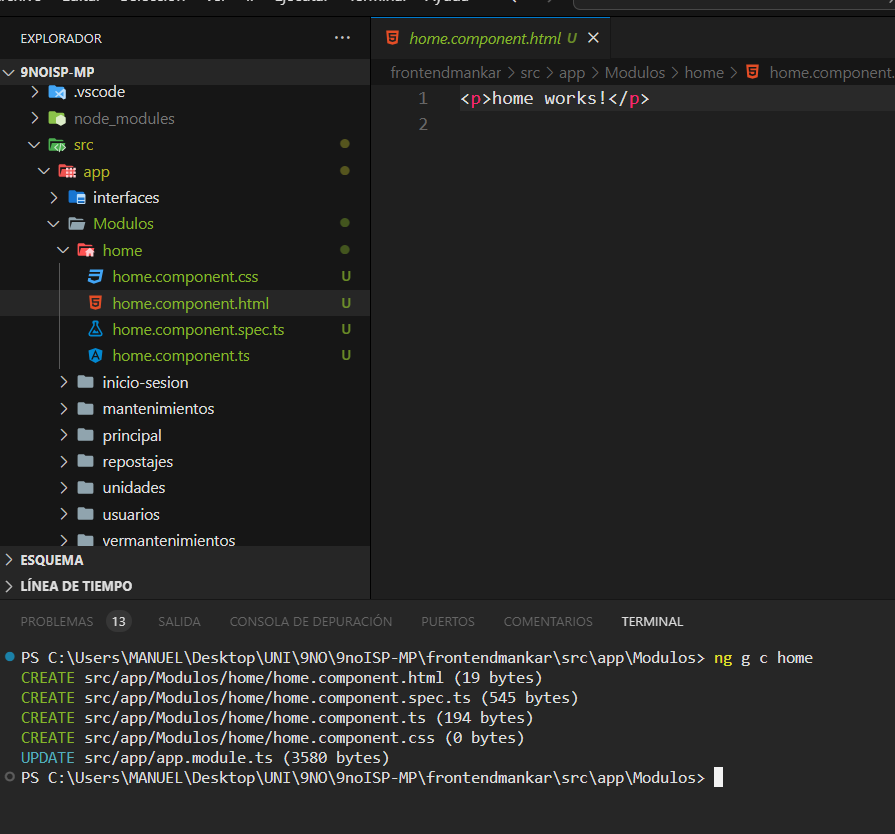
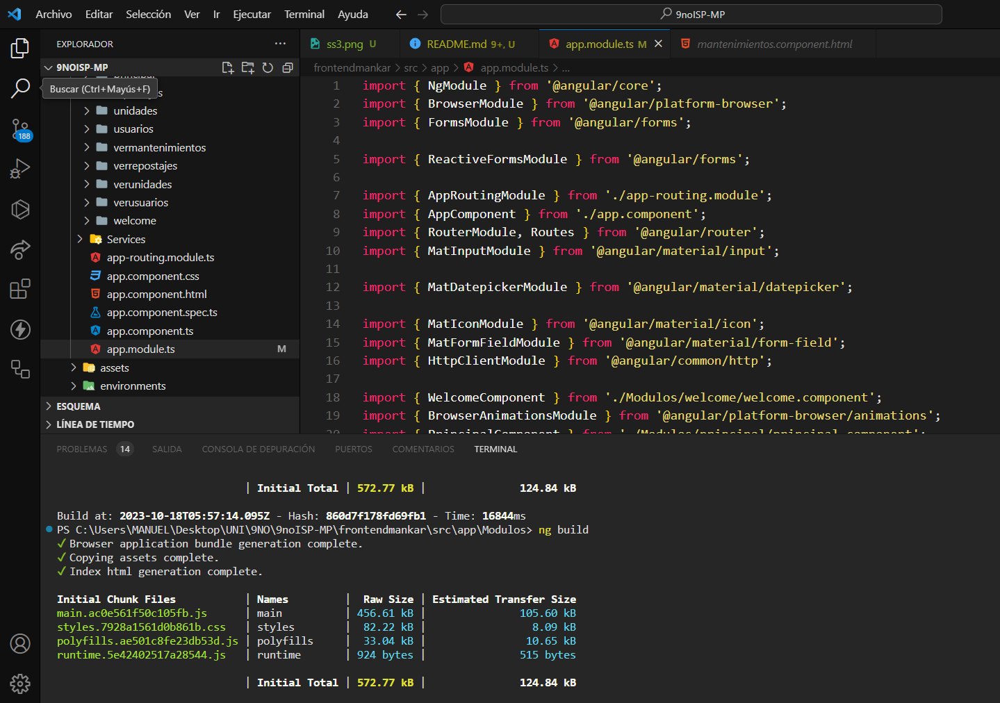
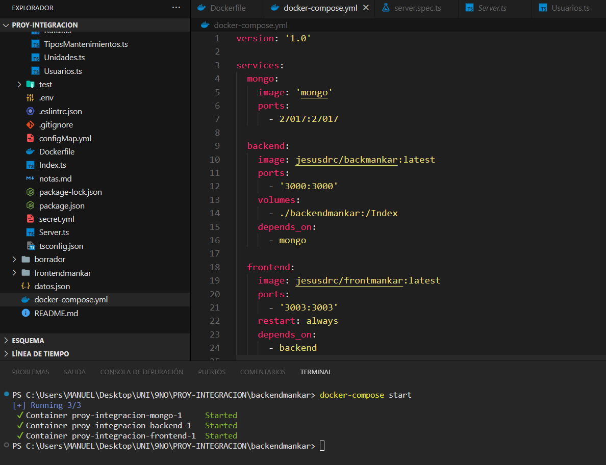
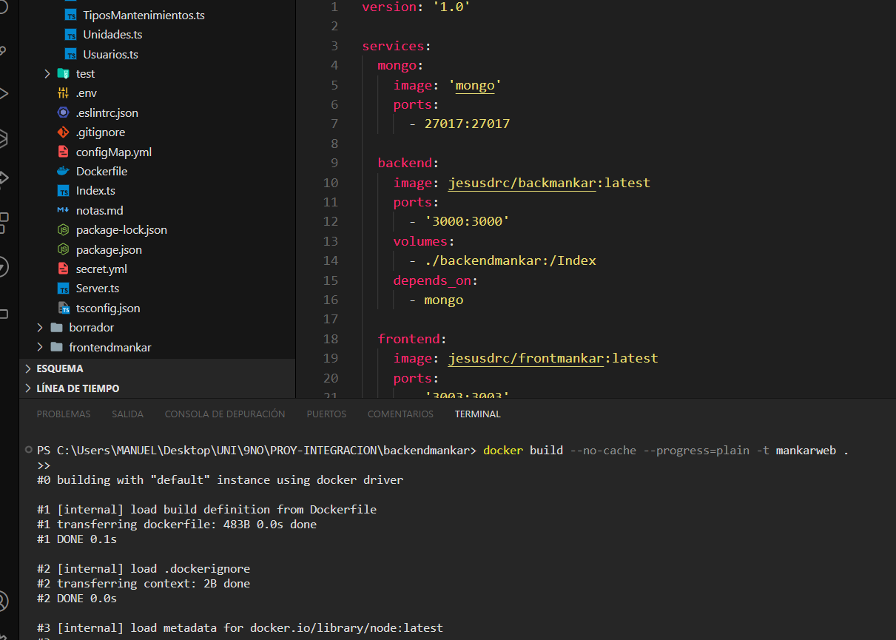
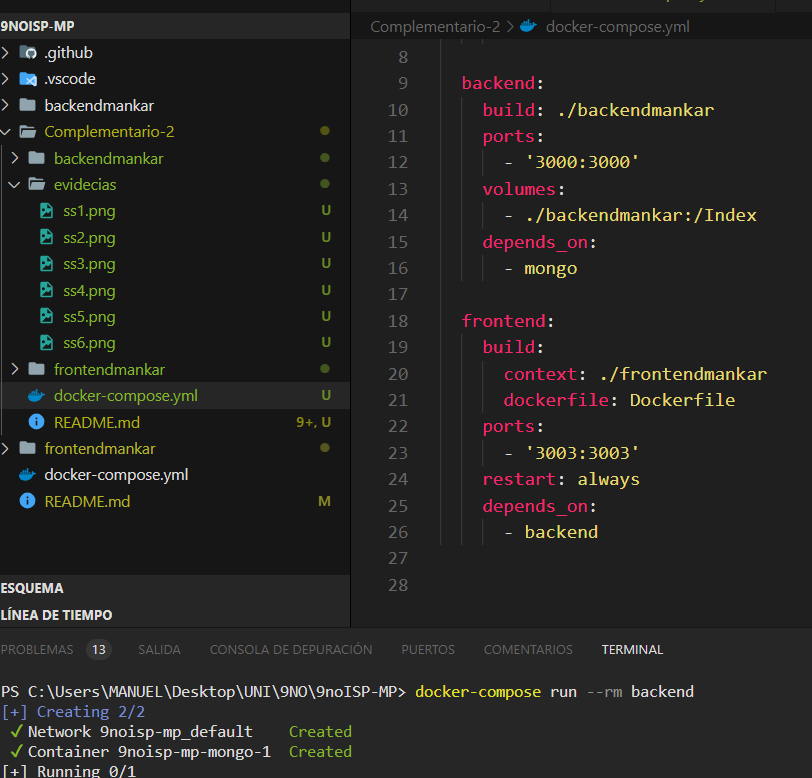
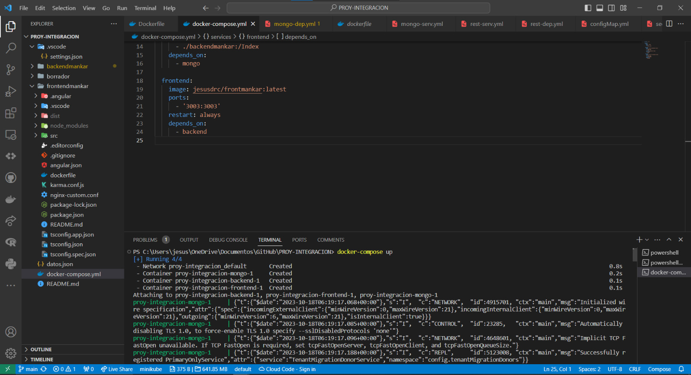
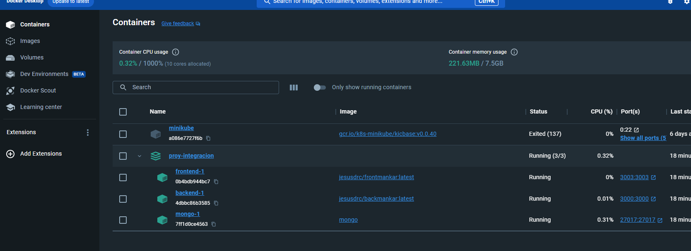
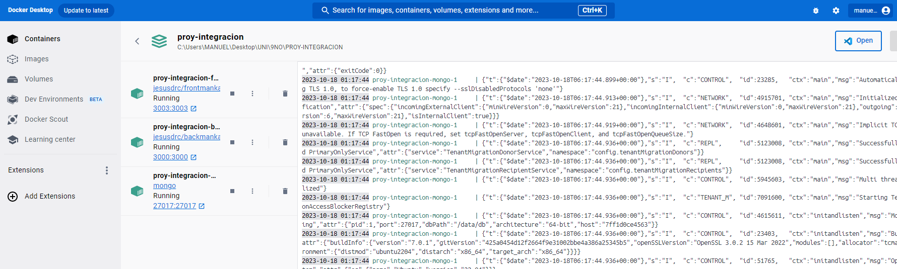

# ActividadDiagnostica
 
# INTEGRANTES
* Muñoz Lopez Kelvin Paul
* Pincay Gonzalez Manuel Jarod
* Reyes Carreño Jesús David 
* Yudeh Andres Branly  

# DIAGRAMA ENTIDAD RELACIÓN

# Asignacion
* Muñoz Lopez Kelvin Paul  -- unidades
* Pincay Gonzalez Manuel Jarod -- Mantenimiento
* Reyes Carreño Jesús David -- Usuarios
* Yudeh Andres Branly -- Repostaje

# Evidencias APP

# Complementario 2

Aplicar Docker y Docker compose en la aplicación (Backend y Frontend) de su entidad desarrollada en práctica anterior

Dockerizar todos los componentes de la aplicación para un entorno de desarrollo
* Frontend

* Backend

Utilizar por lo menos 5 funcionalidades de las herramientas, frameworks o CLI aplicando el acceso a los Dockers de forma interactiva. Ejemplos: Crear nuevo proyecto, agregar componente, etc.

Cargar aplicación funcionando y permitir realizar cambios desde el host que se repliquen en su ambiente de desarrollo.

