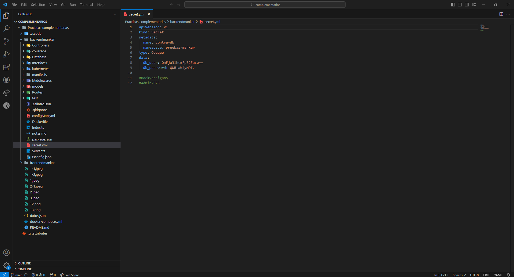
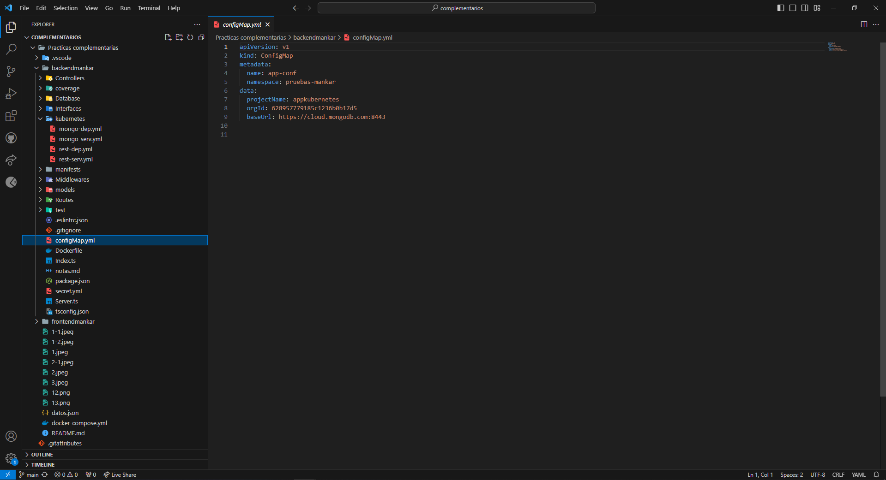
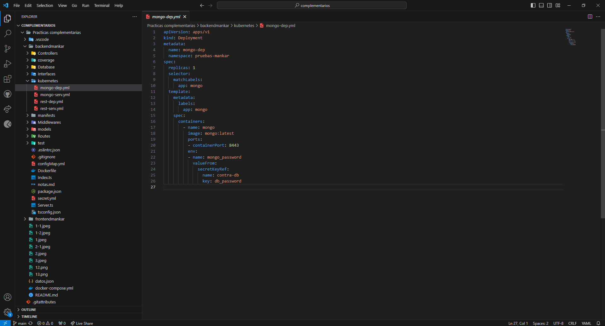
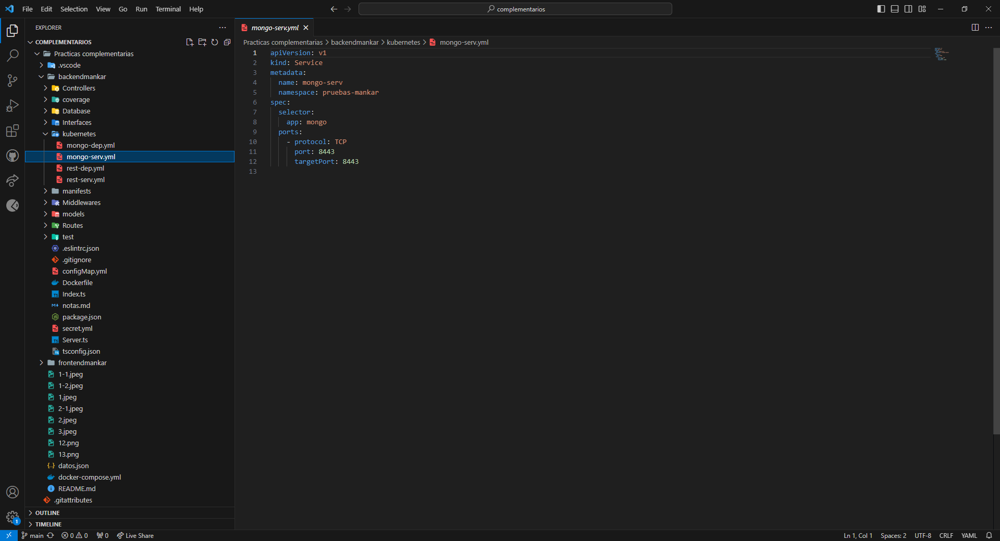
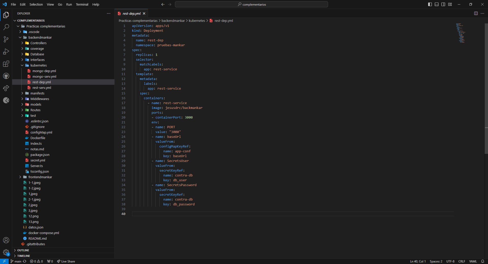
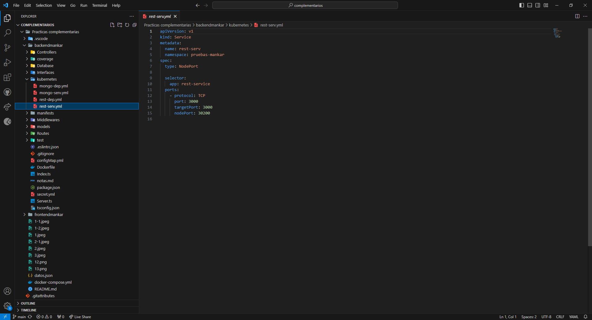
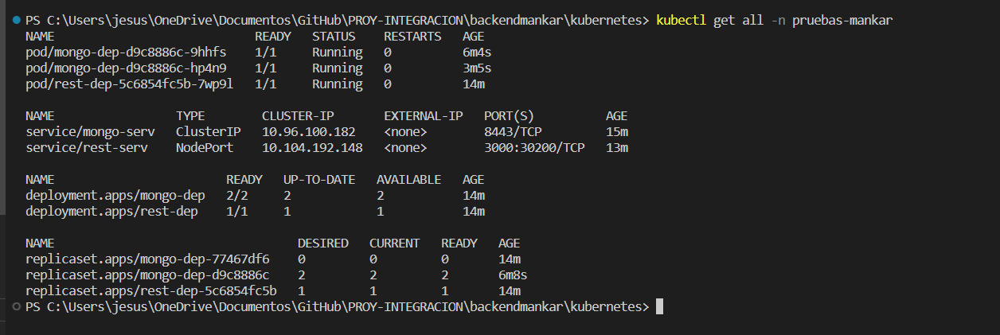
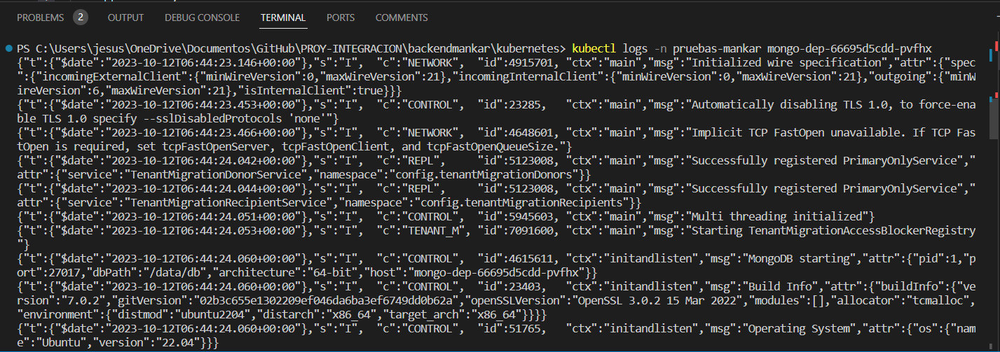
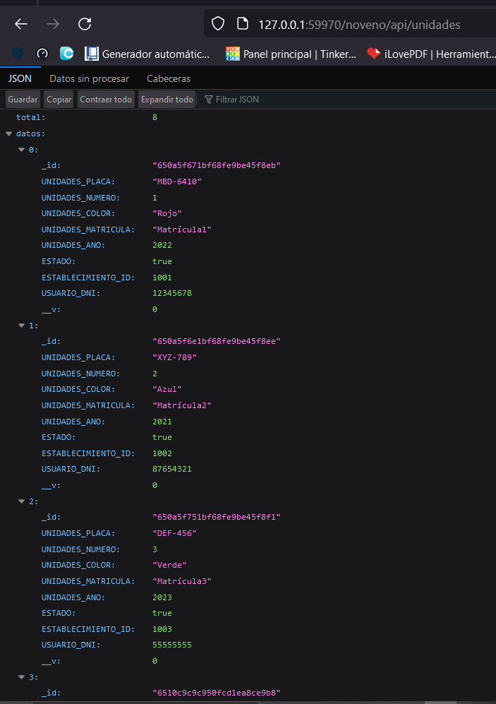

# ActividadDiagnostica
 
# INTEGRANTES
* Muñoz Lopez Kelvin Paul
* Pincay Gonzalez Manuel Jarod
* Reyes Carreño Jesús David 
* Yudeh Andres Branly  

# DIAGRAMA ENTIDAD RELACIÓN

# Asignacion
* Muñoz Lopez Kelvin Paul  -- unidades
* Pincay Gonzalez Manuel Jarod -- Mantenimiento
* Reyes Carreño Jesús David -- Usuarios
* Yudeh Andres Branly -- Repostaje

# Complementario 4

# Definir configuraciones y secretos para los parámetros de su base de datos y servicio REST.
# Definir el Deployment y el Service para levantar su base de datos.
# Definir el Deployment y el Service para levantar su servicio REST.

# Pruebas de funcionamiento 

