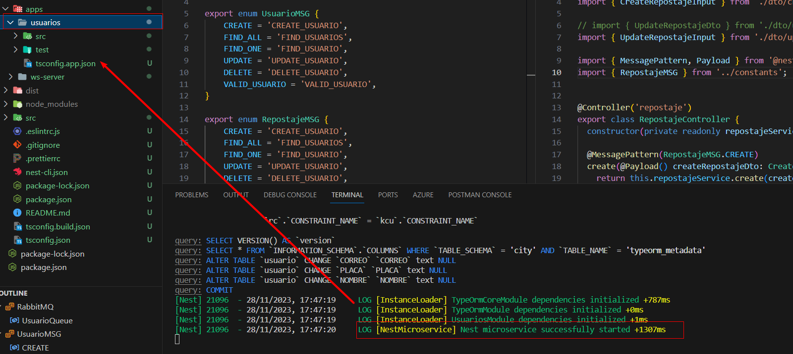
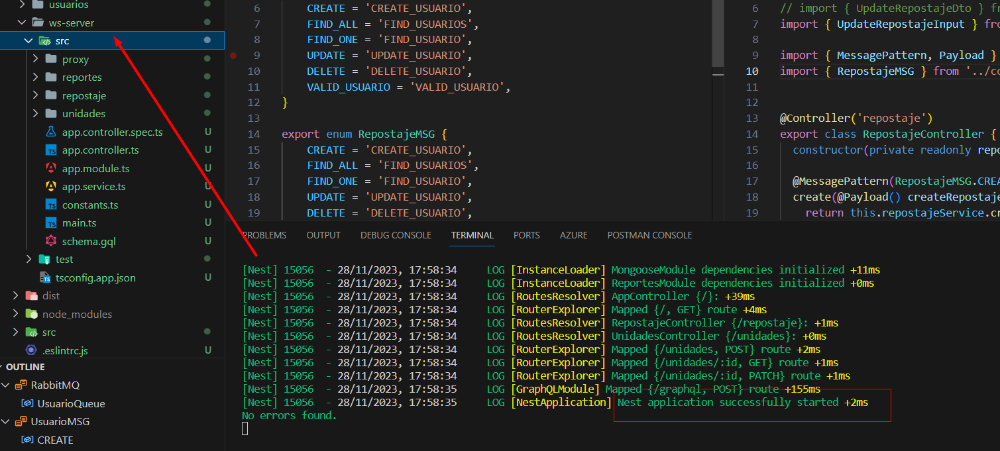
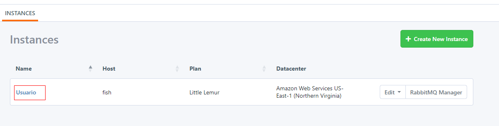
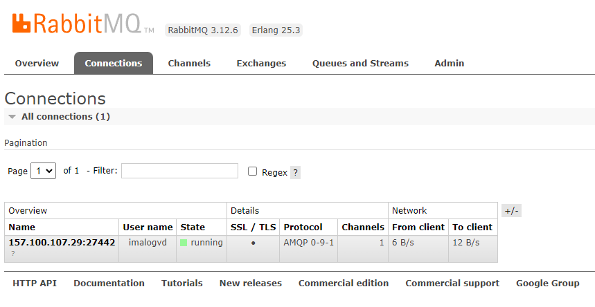
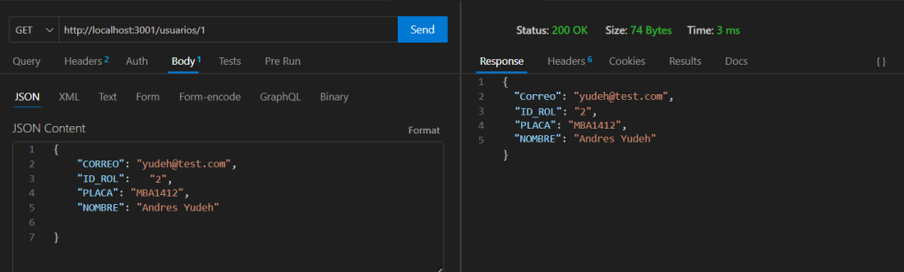

# Complementario 7

# INTEGRANTES
* Muñoz Lopez Kelvin Paul
* Pincay Gonzalez Manuel Jarod
* Reyes Carreño Jesús David 
* Yudeh Andres Branly  

# DIAGRAMA ENTIDAD RELACIÓN

# Asignacion
* Muñoz Lopez Kelvin Paul  -- unidades
* Pincay Gonzalez Manuel Jarod -- Mantenimiento
* Reyes Carreño Jesús David -- Usuarios
* Yudeh Andres Branly -- Repostaje

# 1) Evidencia de que el microservicio Usuario se encuentra levantado.

# 2) Evidencia de que las demas capas se encuentran aparte del microservicio y que se levantan sin problema.

# 3) Evidencia de que que el microservicio usuarios hace uso de rabbitmq.

# 4) Evidencia de que está funcionando correctamente rabbitmq.

# 5)  Evidencia final de que el CRUD funciona a la perfeccion en el microservicio habiendo usando rabbitmq.

