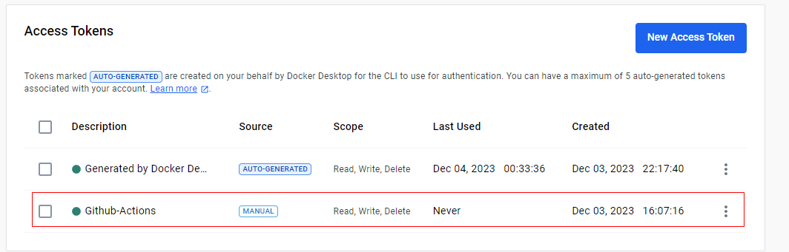

# Complementario 8 - GitHub Actions

# INTEGRANTES
* Muñoz Lopez Kelvin Paul
* Pincay Gonzalez Manuel Jarod
* Reyes Carreño Jesús David 
* Yudeh Andres Branly  

# DIAGRAMA ENTIDAD RELACIÓN

# Asignacion
* Muñoz Lopez Kelvin Paul  -- unidades
* Pincay Gonzalez Manuel Jarod -- Mantenimiento
* Reyes Carreño Jesús David -- Usuarios
* Yudeh Andres Branly -- Repostaje

# 1) Creación de token.

# 2) Creación de secrets (Usuario y Contraseña).

# 3) Creación de workflow.

# 4) Levantamiento/Creación de la imagen.

# 5)  Ejecución de la imagen creada en el lit. anterior.

# 6)  Evidencia de la creación de la imagen en DockerDesktop.

# 7)  Evidencia de la creación en DockerHub.

# 8)  Ejecución del programa.

